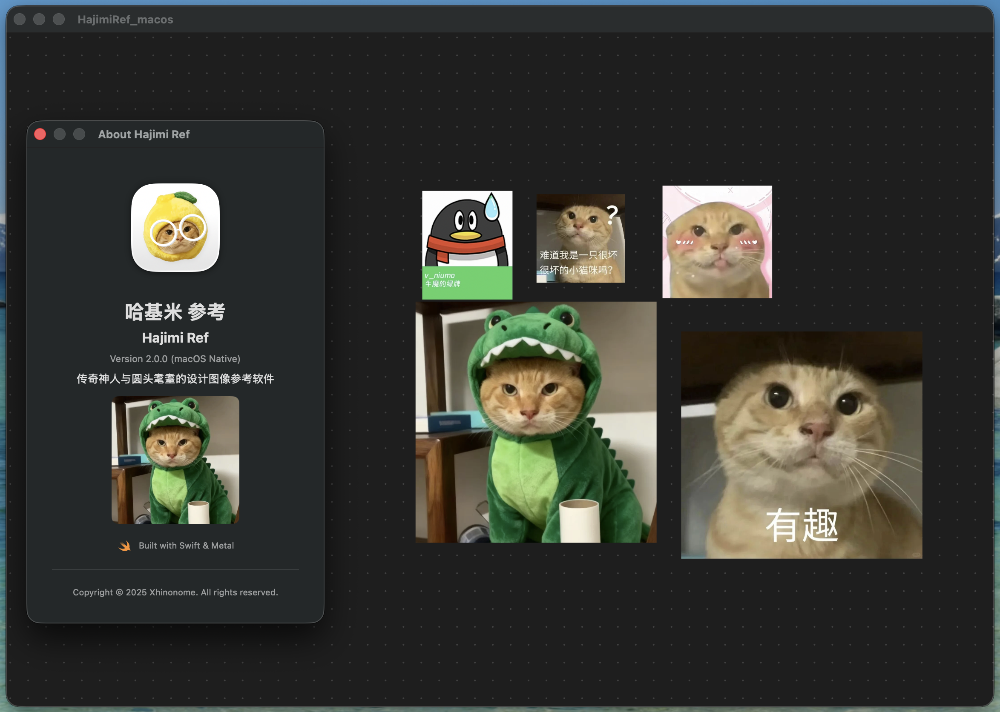

<!--
 * @Author: Xhinonome
 * @Date: 2025-12-01 11:46:20
 * @LastEditors: shiragawayoren
 * @LastEditTime: 2025-12-04 13:13:54
 * @Description: Description
 * hajimi 
-->

# HajimiReff
神人专用的设计参考辅助工具。能让你快速整理你所需要的参考图片，让你快速成为美术设计行业最强哈基米。

## 介绍
将图片拖入进画布，移动、缩放图像。
自由排列组合。
自动整理最大化利用。
始终置顶窗口，让HajimiRef窗口浮现在你的设计程序上方。

