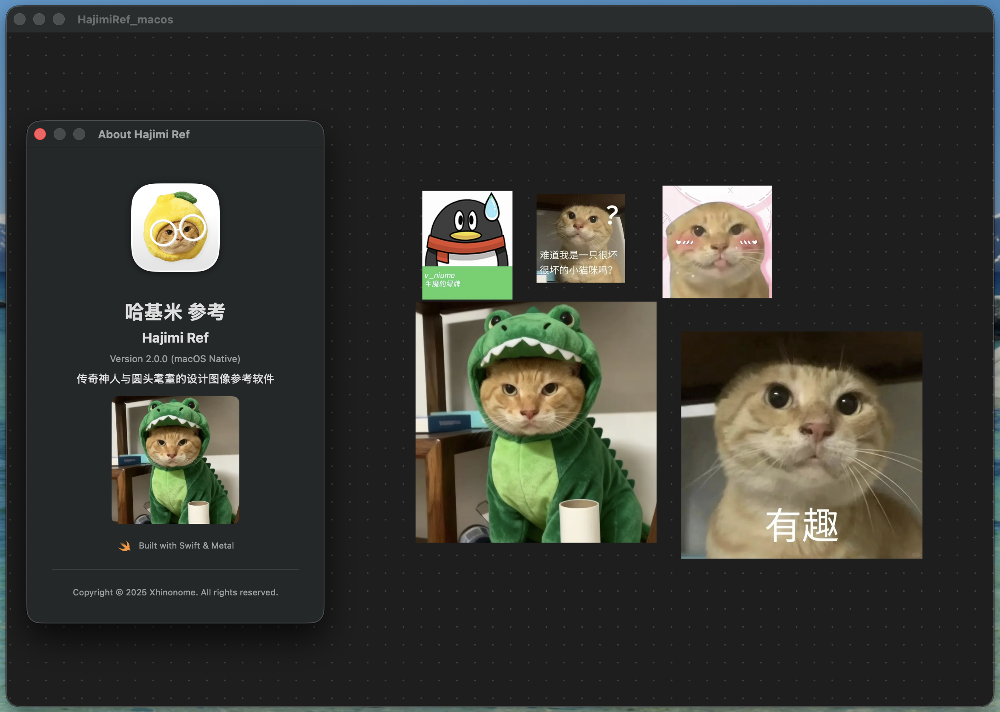

<!--
 * @Author: Xhinonome
 * @Date: 2025-12-01 11:46:20
 * @LastEditors: shiragawayoren
 * @LastEditTime: 2025-12-04 13:13:54
 * @Description: Description
 * hajimi 
-->

# HajimiRef
神人专用的设计参考辅助工具。能让你快速整理你所需要的参考图片，让你快速成为美术设计行业最强哈基米。



## ✨ 介绍

HajimiRef 是一款 **GPU 加速的参考图片查看器**，定位为 [PureRef](https://www.pureref.com/) 的轻量级开源替代品。专为设计师、插画师和创意工作者打造。

- 🖼️ 将图片拖入画布，自由移动、缩放、旋转
- 📐 自由排列组合，无限画布任你发挥
- 🧹 智能整理，一键最大化利用空间
- 📌 始终置顶窗口，让 HajimiRef 浮现在你的设计程序上方

## 🚀 功能特性

### 核心功能

| 功能 | Windows | macOS |
|------|:-------:|:-----:|
| 🖼️ 无限画布 | ✅ | ✅ |
| 📋 粘贴图片 | ✅ | ✅ |
| 🖱️ 拖放导入 | ✅ | ✅ |
| 🔲 多选操作 | ✅ | ✅ |
| 🧹 智能整理 | ✅ | ✅ |
| 🎨 点阵网格背景 | ✅ | ✅ |
| 📌 窗口置顶 | ✅ | ✅ |
| 🌐 多语言 (中/英) | ✅ | ✅ |
| 🎭 AI 背景移除 | ❌ | ✅ (NPU) |

### 性能优化

- **Windows**: OpenGL GPU 加速渲染
- **macOS**: Metal 原生渲染 + Apple Neural Engine (NPU) 加速

## 📥 安装

### Windows

1. 从 [Releases](../../releases) 下载最新的 Windows 版本
2. 解压后运行 `HajimiRef.exe`

**从源码运行：**
```bash
# 安装依赖
pip install -r HajimiRef_win11/requirements.txt

# 运行
python HajimiRef_win11/App.py
```

### macOS

1. 从 [Releases](../../releases) 下载最新的 macOS 版本
2. 将 `HajimiRef.app` 拖入「应用程序」文件夹

**从源码构建：**
```bash
# 使用 Xcode 打开项目
open HajimiRef_macos/HajimiRef_macos.xcodeproj

# 或使用命令行构建
xcodebuild -project HajimiRef_macos/HajimiRef_macos.xcodeproj -scheme HajimiRef_macos
```

## 🎮 使用指南

### 快捷键

| 操作 | Windows | macOS |
|------|---------|-------|
| 新建 | `Ctrl+N` | `⌘N` |
| 打开 | `Ctrl+O` | `⌘O` |
| 保存 | `Ctrl+S` | `⌘S` |
| 粘贴 | `Ctrl+V` | `⌘V` |
| 全选 | `Ctrl+A` | `⌘A` |
| 删除选中 | `Delete` | `⌫` |
| 智能整理 | `Ctrl+L` | `⌘L` |
| 适应窗口 | `Ctrl+F` | `⌘F` |
| 窗口置顶 | 菜单切换 | `⌘T` |

### 基本操作

- **添加图片**: 拖放文件到窗口 / `Ctrl+V` 粘贴 / 菜单导入
- **移动图片**: 直接拖拽图片
- **缩放图片**: 选中图片后滚动鼠标滚轮
- **旋转图片**: 选中图片后使用快捷键或菜单
- **多选**: 按住 `Ctrl/⌘` 点击 或 框选
- **画布缩放**: `Ctrl/⌘` + 滚轮
- **画布平移**: 中键拖拽 或 按住空格拖拽

### 文件格式

HajimiRef 使用 `.sref` 格式保存看板，这是一种基于 JSON 的格式，可在 Windows 和 macOS 之间互通。

## 🛠️ 技术栈

### Windows 版本
- **语言**: Python 3.8+
- **GUI**: PySide6 (Qt 6)
- **渲染**: QOpenGLWidget
- **布局**: rectpack
- **打包**: PyInstaller

### macOS 版本
- **语言**: Swift 5.9
- **UI**: SwiftUI + AppKit
- **渲染**: Metal
- **AI**: Vision Framework (NPU)
- **最低要求**: macOS 12+

## 📁 项目结构

```
Hajimi_ref/
├── HajimiRef_macos/        # macOS 原生版本
│   └── HajimiRef_macos/
│       ├── Models/         # 数据模型
│       ├── Views/          # UI 视图
│       └── *.lproj/        # 本地化资源
├── HajimiRef_win11/        # Windows 版本
│   ├── Views/              # UI 视图
│   ├── ViewModels/         # 视图模型
│   └── assets/             # 资源文件
├── docs/                   # 项目文档
│   ├── 技术文档.md
│   ├── 策划案.md
│   └── 更新说明.md
├── icon/                   # 共享图标资源
└── README.md
```


---

**让你成为美术设计行业最强哈基米！** 🐹
