# Hajimi Ref 技术文档

## 1. 项目概述
Hajimi Ref 是一款**跨平台参考图查看器**，定位为轻量级开源替代品。专为设计师、插画师和创意工作者打造。项目坚持"少依赖、高性能"的原则，在不同平台使用原生最佳技术栈实现最佳性能。

### 1.1 双平台架构
- **Windows 版本**: 基于 Python + PySide6 (Qt6) 开发，使用 OpenGL GPU 加速渲染
- **macOS 版本**: 基于 Swift 5.9 + SwiftUI 开发，使用 Metal 原生渲染和 Apple Neural Engine (NPU) 加速

### 1.2 核心特性
- 🖼️ 无限画布，自由移动、缩放、旋转图片
- 📋 支持粘贴图片、拖放导入
- 🔲 多选操作与智能整理
- 🎨 点阵网格背景（可自定义）
- 📌 窗口置顶功能
- 🌐 多语言支持（中/英）
- 🎭 macOS 版本支持 AI 背景移除（NPU 加速）
- 🗂️ 图片打组功能（PureRef 风格）
- ↩️ 完整的撤销/重做系统
- 📊 图层顺序管理

## 2. Windows 版本技术架构

### 2.0 架构图总览

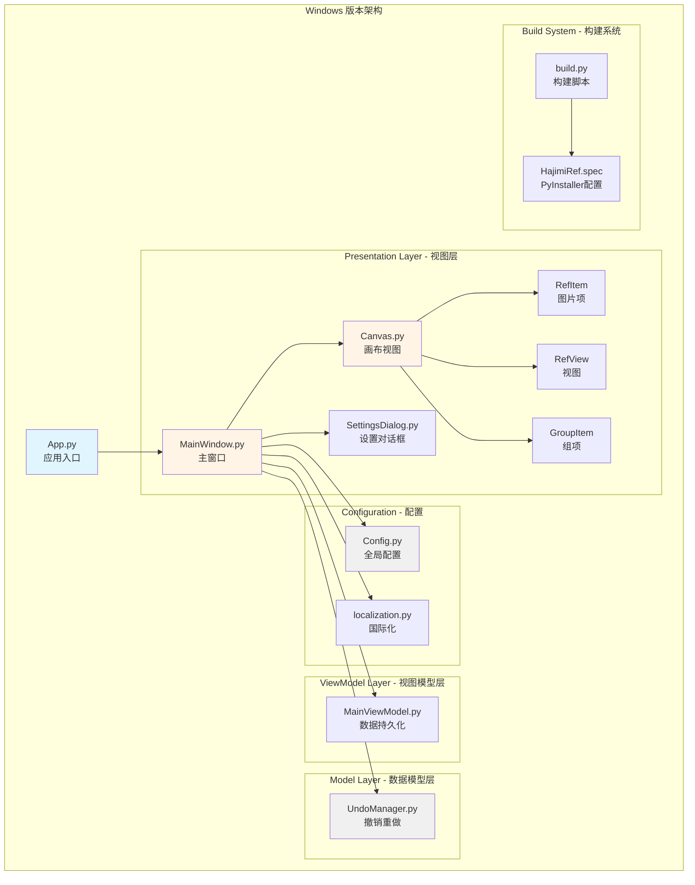

### 2.0.1 类关系图

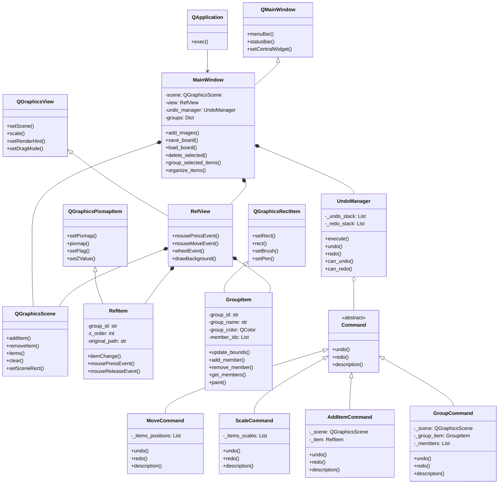

### 2.1 核心依赖
- **Python 3.8+**: 开发语言
- **PySide6 (Qt 6)**: GUI 框架，提供现代化的跨平台 UI
- **Pillow**: 图像处理库（读取、解码、编码）
- **PyOpenGL**: OpenGL 绑定，用于 GPU 加速渲染
- **rectpack**: 矩形打包算法，用于智能整理布局
- **PyInstaller**: 打包为独立 EXE 文件

### 2.2 类结构设计

#### `RefItem` 类
负责单个图像对象的管理。
*   **继承关系**: 继承自 `QGraphicsPixmapItem`，利用 Qt 的图形项框架
*   **渲染逻辑**: 
    *   Qt 的图形视图框架自动处理视口裁剪和绘制优化
    *   GPU 加速渲染通过 QOpenGLWidget 实现，大幅提升大图性能
*   **交互支持**: 支持移动、缩放、旋转、删除等操作
*   **图层管理**: 通过 `zValue()` 管理图层顺序

#### `RefView` 类
继承自 `QGraphicsView`，实现无限画布效果。
*   **交互事件**:
    *   **平移 (Pan)**: 监听中键拖拽，使用 `scrollContentsBy` 实现画布平移
    *   **缩放 (Zoom)**: 监听滚轮事件，使用 `scale()` 方法实现视图缩放
    *   **多选**: 支持框选和 Ctrl 点击多选
*   **渲染优化**:
    *   活动区域渲染：仅渲染可见范围内的内容
    *   固定扩展边界机制：优化大尺寸画板的渲染性能
    *   优化了 `drawBackground()` 方法，减少不必要的重绘

#### `GroupItem` 类
实现图片打组功能。
*   **数据结构**: 半透明颜色衬底背景，预设美观颜色（矢车菊蓝、浅绿色等）
*   **交互特性**:
    *   拖拽组时，所有成员图片跟随移动
    *   四角调整手柄，可调整组边界大小
    *   调整边界自动拉入新图片
    *   图片拖出组外自动移除
    *   双击组名称快速编辑
*   **序列化**: 支持保存和加载组信息（颜色、透明度、名称等）

#### `MainWindow` 类
主应用程序类，管理窗口生命周期和全局交互。
*   **场景管理**: 使用 `QGraphicsScene` 管理 `RefItem` 和 `GroupItem`
*   **菜单系统**: 完整的菜单栏，包含文件、编辑、设置、帮助等菜单
*   **快捷键系统**: 使用 QShortcut 绑定快捷键，支持撤销/重做等操作
*   **撤销/重做管理**: 集成 `UndoManager` 实现完整的撤销/重做功能

### 2.3 撤销/重做系统

#### 命令模式架构图

```mermaid
graph TB
    subgraph "Command Pattern - 命令模式架构"
        Invoker[Invoker<br/>调用者<br/>MainWindow]
        Receiver[Receiver<br/>接收者<br/>QGraphicsScene/Items]
        Command[Command<br/>抽象命令]
        ConcreteCommand[ConcreteCommand<br/>具体命令]
        
        Invoker -.-> Command
        Command --> Receiver
        Command <|-- ConcreteCommand
        
        subgraph "Concrete Commands - 具体命令"
            MC[MoveCommand]
            SC[ScaleCommand]
            RC[RotateCommand]
            AIC[AddItemCommand]
            DIC[DeleteItemsCommand]
            CBC[ClearBoardCommand]
            OIC[OrganizeItemsCommand]
            GC[GroupCommand]
            UGC[UngroupCommand]
            GMC[GroupMoveCommand]
        end
        
        ConcreteCommand -.-> MC
        ConcreteCommand -.-> SC
        ConcreteCommand -.-> RC
        ConcreteCommand -.-> AIC
        ConcreteCommand -.-> DIC
        ConcreteCommand -.-> CBC
        ConcreteCommand -.-> OIC
        ConcreteCommand -.-> GC
        ConcreteCommand -.-> UGC
        ConcreteCommand -.-> GMC
    end
    
    style Command fill:#ff9999
    style Invoker fill:#99ccff
    style Receiver fill:#99ff99
```

#### 撤销/重做流程图

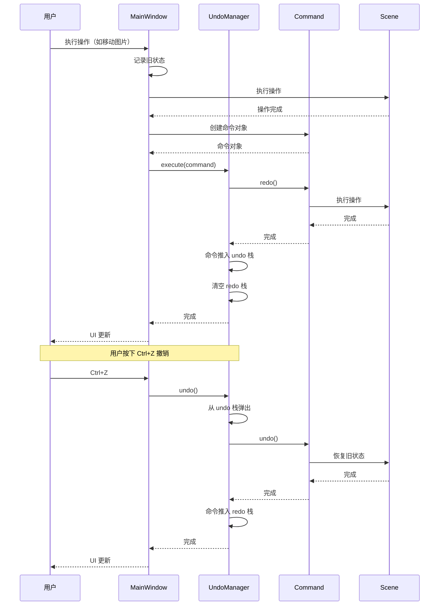

#### UndoManager 类
基于**命令模式**实现的撤销/重做管理器。
*   **核心设计**:
    *   抽象 `Command` 基类，定义 `undo()`、`redo()` 和 `description()` 方法
    *   支持的历史记录数量可配置（默认 100）
    *   命令栈使用双栈结构（undo 栈和 redo 栈）
*   **支持的操作**:
    *   `MoveCommand`: 移动图片
    *   `ScaleCommand`: 缩放图片
    *   `RotateCommand`: 旋转图片
    *   `AddItemCommand`: 添加图片
    *   `DeleteItemsCommand`: 删除图片
    *   `ClearBoardCommand`: 清空画板
    *   `OrganizeItemsCommand`: 智能整理
    *   `GroupCommand`: 创建组
    *   `UngroupCommand`: 解散组
    *   `GroupMoveCommand`: 移动组
*   **集成方式**: 
    *   在菜单栏添加编辑菜单，包含撤销/重做选项
    *   快捷键：`Ctrl+Z`（撤销）、`Ctrl+Shift+Z`（重做）

### 2.4 智能整理功能

#### rectpack 算法流程图

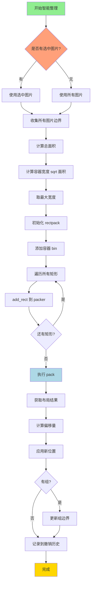

#### 智能整理详细实现

**算法说明**:

rectpack 使用"递归水平分割"算法，这是一个经典的一维装箱问题变种。

**参数优化**:

```python
# 容器宽度计算
approx_side = int(math.ceil(math.sqrt(total_area)))
bin_width = max(approx_side, max(w for w, h, it, r in rects))
bin_height = int(math.ceil(total_area / bin_width)) + max(h for w, h, it, r in rects) * 2
```

- `bin_width`: 基于 `sqrt(total_area)` 计算，确保容器接近正方形
- 额外添加 `max(w)` 确保单个矩形也能放入
- `bin_height`: 基于总面积除以宽度，再添加两倍最大高度作为缓冲

**位置映射**:

rectpack 使用左上角坐标系 (0,0)，Qt 使用中心点坐标系，需要进行转换：

```python
# Qt 场景坐标
old_scene_rect = item.sceneBoundingRect()  # 左上角

# rectpack 坐标
target_x = start_x + float(rect.x)  # 左上角
target_y = start_y + float(rect.y)

# 计算偏移
offset_x = target_x - old_scene_rect.x()
offset_y = target_y - old_scene_rect.y()

# 应用偏移
item.moveBy(offset_x, offset_y)
```

**组边界更新**:

整理后，组的边界可能不再包含所有成员，需要重新计算：

```python
# 找到组中的所有成员
group_members = group.get_members()

# 计算新的联合边界
union_rect = QRectF()
for member in group_members:
    union_rect = union_rect.united(member.sceneBoundingRect())

# 更新组边界
group.update_bounds(group_members)
```

**性能考虑**:

- 时间复杂度: O(n log n) (n 为图片数量)
- 空间复杂度: O(n)
- 适用于 1000 张以内的图片（实测 500 张约 2 秒）

### 2.5 打组功能

#### 打组流程图

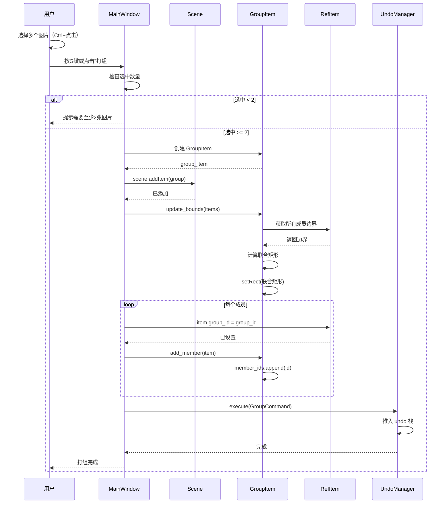

#### 组边界更新流程图

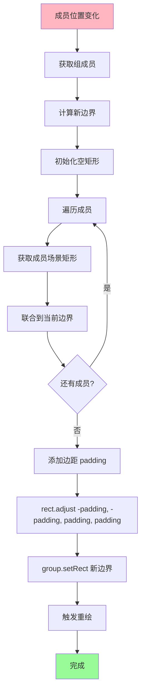

#### 组调整大小流程图

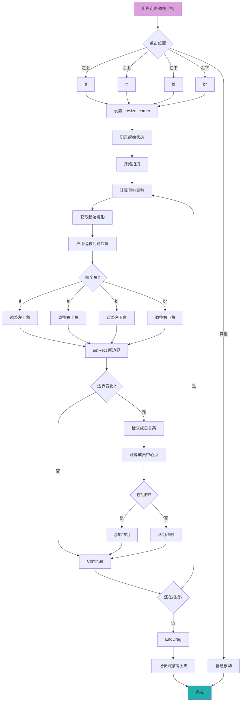

#### 组成员判定算法

**判定标准**: 使用图片中心点

```python
def is_inside_group(item_rect, group_rect):
    """
    判断图片是否在组内
    
    算法：
    1. 计算图片中心点
    2. 检查中心点是否在组矩形内
    
    Args:
        item_rect: 图片的场景矩形 QRectF
        group_rect: 组矩形 QRectF
    
    Returns:
        bool: 是否在组内
    """
    item_center = item_rect.center()
    return (group_rect.left() <= item_center.x() <= group_rect.right() and
            group_rect.top() <= item_center.y() <= group_rect.bottom())
```

**为什么使用中心点？**

- **准确性**: 中心点最能代表图片的"主体"位置
- **稳定性**: 不会因为轻微移动而频繁切换状态
- **直观性**: 符合用户的直觉判断

**其他方案对比**:

| 方案 | 优点 | 缺点 |
|------|------|------|
| 中心点判定 | 稳定、直观 | 边缘图片可能被误判 |
| 包含判定 | 准确 | 边缘移动频繁切换 |
| 覆盖度判定 | 灵活 | 计算复杂 |

## 3. macOS 版本技术架构

### 3.0 架构图总览

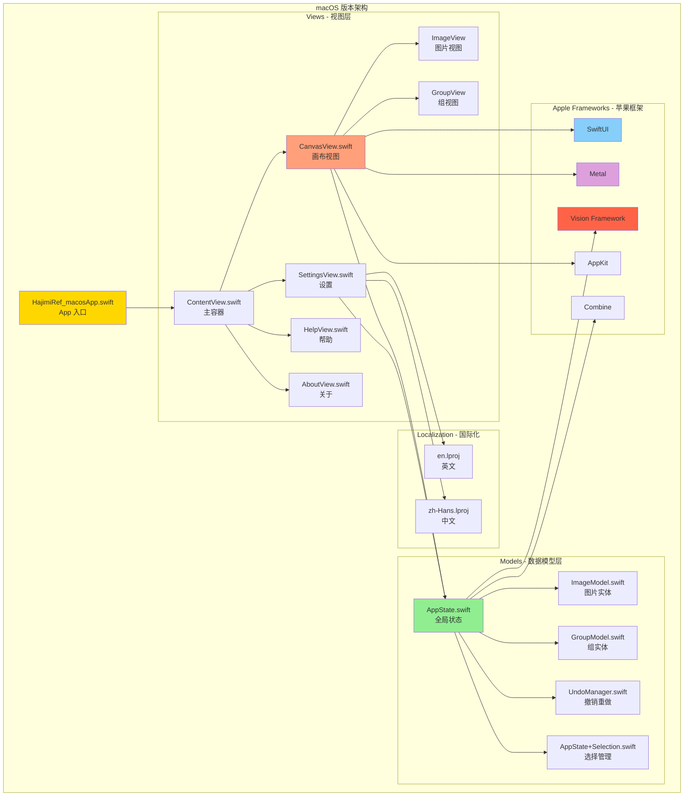

### 3.0.1 数据流架构图

```mermaid
graph LR
    subgraph "用户交互"
        Drag[拖放/粘贴]
        Click[点击/拖拽]
        Scroll[滚轮/触控板]
    end
    
    subgraph "事件处理"
        Window[WindowAccessor]
        Event[NSEvent Monitor]
    end
    
    subgraph "状态管理"
        AppState[AppState<br/>@Observable]
        Images[images 数组]
        CanvasState[canvasOffset/canvasScale]
    end
    
    subgraph "视图渲染"
        CanvasView[CanvasView]
        ZStack[ZStack]
        ImageView[ImageView]
        GroupView[GroupView]
    end
    
    subgraph "持久化"
        Save[保存 .sref]
        Load[加载 .sref]
        Export[导出图片]
    end
    
    subgraph "AI 功能"
        Vision[Vision Framework]
        NPU[Neural Engine]
        BGRemove[背景移除]
    end
    
    Drag --> Event
    Click --> Event
    Scroll --> Event
    Event --> AppState
    AppState --> Images
    AppState --> CanvasState
    Images --> ZStack
    CanvasState --> CanvasView
    CanvasView --> ImageView
    CanvasView --> GroupView
    AppState --> Save
    AppState --> Load
    AppState --> Export
    AppState --> Vision
    Vision --> NPU
    NPU --> BGRemove
    BGRemove --> AppState
    
    style AppState fill:#FFD700
    style CanvasView fill:#90EE90
    style Vision fill:#FF6347
```

### 3.1 核心技术栈
- **Swift 5.9**: 开发语言
- **SwiftUI**: 声明式 UI 框架
- **AppKit**: 底层窗口与输入处理
- **Metal**: 原生 GPU 渲染
- **Vision Framework**: Apple Neural Engine (NPU) 加速 AI 功能
- **最低要求**: macOS 12+

### 3.2 核心模块设计

#### AppState 类架构图

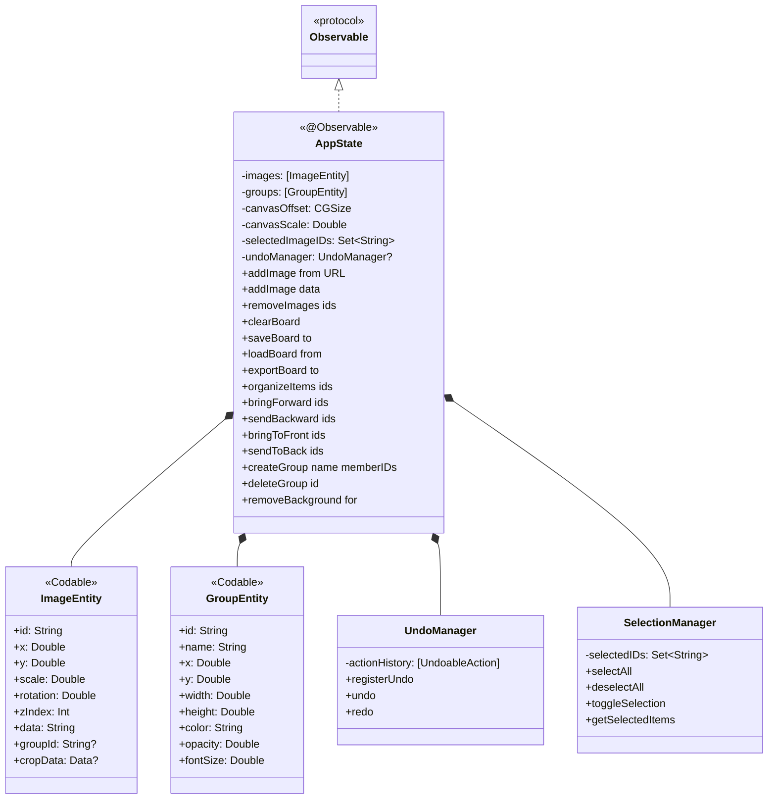

#### CanvasView 架构图

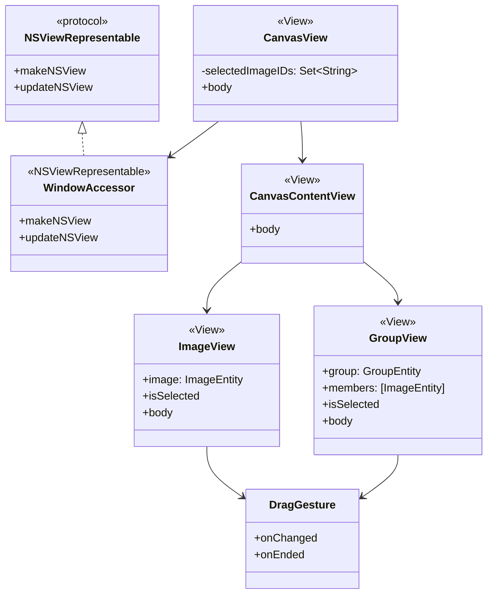

#### AppState 类
基于 Swift `Observation` 框架 (`@Observable`) 的全局状态管理类。
*   **数据源**: 管理 `images` 数组和画布状态 (`canvasOffset`, `canvasScale`)
*   **逻辑中心**: 处理图片的增删改查、文件 I/O、NPU 请求调度
*   **内存管理**: 包含 `compactMemory()` 预留接口，利用 ARC 自动管理内存
*   **选择管理**: 使用 `SelectionManager` 集中管理多选状态

#### `CanvasView` 类
混合渲染与事件拦截层。
*   **事件系统重构**:
    *   **WindowAccessor**: 通过 `NSViewRepresentable` 获取底层 `NSWindow` 实例
    *   **全局事件监听**: 使用 `NSEvent.addLocalMonitorForEvents` 在窗口级别拦截鼠标和键盘事件
    *   解决了 SwiftUI `DragGesture` 吞噬鼠标中键和滚轮事件的问题
*   **无限画布**:
    *   通过 `ZStack` 配合全局 `offset` 和 `scaleEffect` 模拟 2D 摄像机运动
    *   Metal 原生渲染，系统自动处理裁剪和离屏渲染
*   **交互优化**:
    *   **恒定视觉边框**: 动态计算边框宽度 (`3.0 / totalScale`)，确保在任何缩放级别下选中框保持恒定像素宽度
    *   **平滑滚动**: 利用 Metal 的平滑滚动特性

#### `ImageEntity` 结构体
*   **数据结构**: 遵循 `Codable` 协议，支持 JSON 序列化
*   **属性**:
    *   `id`: 唯一标识符
    *   `x`, `y`: 位置坐标
    *   `scale`: 缩放比例
    *   `rotation`: 旋转角度
    *   `zIndex`: 图层顺序
    *   `data`: Base64 编码的图片数据
    *   `cropData`: 背景移除后的图片数据（可选）
*   **懒加载**: 图片数据以 Base64 字符串存储，仅在渲染时转换为 `NSImage`

### 3.3 NPU 加速背景移除

#### 背景移除流程图

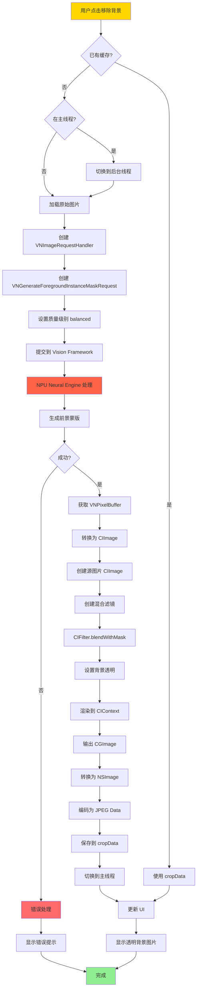

#### Vision Framework 详细说明

**VNGenerateForegroundInstanceMaskRequest**:

```swift
// 创建前景蒙版请求
let request = VNGenerateForegroundInstanceMaskRequest()

// 设置质量级别
// .fast: 快速但精度较低
// .balanced: 平衡（默认）
// .accurate: 精确但速度较慢
request.qualityLevel = .balanced

// 设置回调
request completionHandler = { request, error in
    guard let observations = request.results as? [VNInstanceMaskObservation],
          let mask = observations.first?.pixelBuffer else {
        return
    }
    
    // 处理蒙版
}
```

**CoreImage 混合滤镜**:

```swift
// 创建混合滤镜
let blendFilter = CIFilter(name: "CIBlendWithMask")!

// 设置输入图片
blendFilter.setValue(sourceCIImage, forKey: kCIInputImageKey)
blendFilter.setValue(maskCIImage, forKey: kCIInputMaskImageKey)

// 设置背景图片（透明）
let transparentImage = CIImage(color: .clear)
blendFilter.setValue(transparentImage, forKey: kCIInputBackgroundImageKey)

// 获取输出
guard let outputImage = blendFilter.outputImage else { return }
```

**性能优化**:

```swift
// 使用 Metal 加速渲染
let ciContext = CIContext(options: [
    .useSoftwareRenderer: false,  // 使用 GPU
    .priorityRequestLow: false    // 高优先级
])

// 渲染输出
let cgImage = ciContext.createCGImage(outputImage, from: outputImage.extent)
```

**NPU 优势**:

| 特性 | CPU | GPU | NPU |
|------|-----|-----|-----|
| 功耗 | 高 | 中 | 低 |
| 速度 | 慢 | 快 | 极快 |
| 精度 | 高 | 中 | 高 |
| 适用场景 | 简单计算 | 并行计算 | 神经网络 |

#### ImageEntity 结构体
*   **数据结构**: 遵循 `Codable` 协议，支持 JSON 序列化
*   **属性**:
    *   `id`: 唯一标识符
    *   `x`, `y`: 位置坐标
    *   `scale`: 缩放比例
    *   `rotation`: 旋转角度
    *   `zIndex`: 图层顺序
    *   `data`: Base64 编码的图片数据
    *   `cropData`: 背景移除后的图片数据（可选）
*   **懒加载**: 图片数据以 Base64 字符串存储，仅在渲染时转换为 `NSImage`

### 3.4 撤销/重做系统

#### macOS 撤销重做架构图

```mermaid
graph TB
    subgraph "macOS 撤销重做架构"
        App[NSApplication]
        UM[NSUndoManager]
        
        subgraph "AppState"
            State[AppState<br/>@Observable]
            register[registerUndo]
        end
        
        subgraph "UndoableAction 枚举"
            UA[UndoableAction]
            Add[addImage]
            Del[deleteImage]
            Move[moveImage]
            Scale[scaleImage]
            Rotate[rotateImage]
            Org[organizeItems]
            GCreate[createGroup]
            GDel[deleteGroup]
        end
        
        App --> UM
        UM --> State
        State --> register
        register --> UA
        UA --> Add
        UA --> Del
        UA --> Move
        UA --> Scale
        UA --> Rotate
        UA --> Org
        UA --> GCreate
        UA --> GDel
    end
    
    style UM fill:#FFD700
    style State fill:#90EE90
    style UA fill:#FFA07A
```

#### 撤销重做流程图

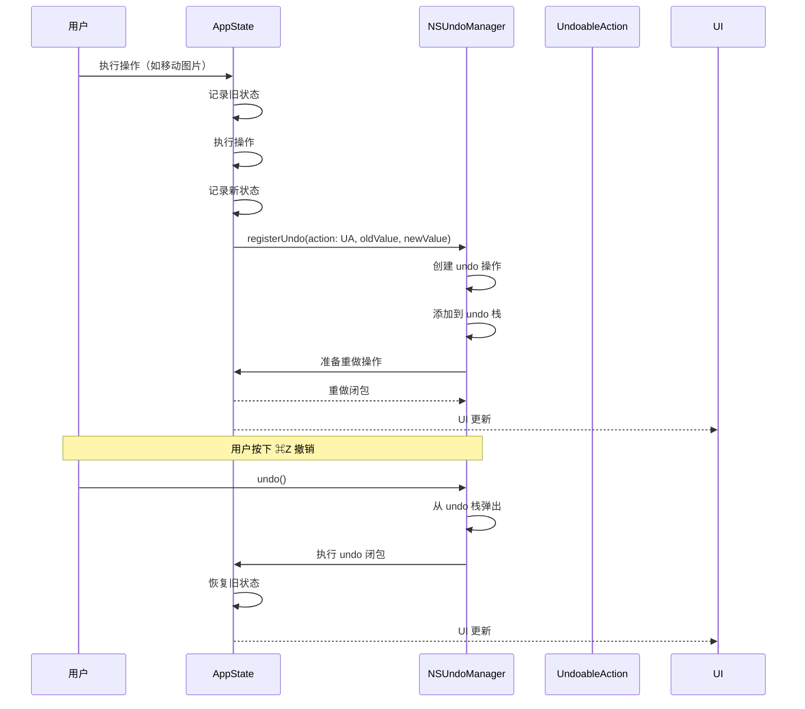

#### UndoableAction 枚举设计

```swift
enum UndoableAction {
    case addImage([ImageEntity])
    case deleteImage([ImageEntity])
    case clearBoard([ImageEntity])
    case moveImage([String: (x: Double, y: Double)])
    case scaleImage([String: Double])
    case rotateImage([String: Double])
    case zIndexChange([String: Int])
    case organizeItems([String: (x: Double, y: Double)])
    case createGroup(GroupEntity)
    case deleteGroup(GroupEntity)
    case updateGroup(id: String, old: GroupEntity, new: GroupEntity)
}
```

**设计考虑**:
- 使用关联值存储状态快照
- 支持批量操作（如多选移动）
- 类型安全，避免运行时错误

#### registerUndo 实现

```swift
func registerUndo<T>(with action: UndoableAction, oldValue: T, newValue: T) {
    guard let undoManager = undoManager else { return }
    
    undoManager.registerUndo(withTarget: self) { target in
        // 执行 undo（恢复旧值）
        target.applyUndo(action: action, value: oldValue)
        
        // 准备 redo
        target.registerUndo(with: action, oldValue: oldValue, newValue: newValue)
    }
    
    undoManager.setActionName(action.description)
}
```

**工作原理**:
1. 注册 undo 操作到 `NSUndoManager`
2. undo 操作会调用 `applyUndo` 恢复旧值
3. 同时注册 redo 操作（交换新旧值）
4. `NSUndoManager` 自动管理 undo/redo 栈

---

## 4.1 存档格式
*   **格式**: 自定义 `.sref` 格式（本质为 JSON）
*   **版本**: 当前版本 v4（支持组信息）
*   **内容**: 包含版本号、所有图片的 Base64 编码数据、位置坐标、缩放比例、旋转角度、图层顺序、组信息等

### 4.2 字段说明
```json
{
  "version": 4,
  "images": [
    {
      "x": 100,
      "y": 100,
      "scale": 1.0,
      "rotation": 0,
      "zIndex": 0,
      "data": "base64编码的图片数据",
      "groupId": "组ID（可选）"
    }
  ],
  "groups": [
    {
      "id": "组ID",
      "name": "组名称",
      "x": 0,
      "y": 0,
      "width": 500,
      "height": 500,
      "color": "rgba颜色值",
      "opacity": 0.5,
      "fontSize": 16
    }
  ]
}
```

### 4.3 互通性
- Windows 和 macOS 版本使用相同的 `.sref` 格式
- 新版本支持加载旧版本存档（向后兼容）
- 旧版本加载新版本存档时会忽略不支持的字段

## 5. 性能优化策略

### 5.1 Windows 版本
- **OpenGL GPU 加速**: 使用 QOpenGLWidget 进行硬件加速渲染
- **活动区域渲染**: 仅渲染可见范围内的内容，减少不必要的绘制
- **固定扩展边界**: 避免动态扩展带来的性能开销
- **Qt 图形视图框架优化**: 利用 Qt 内置的视口裁剪和脏矩形优化

### 5.2 macOS 版本
- **Metal 原生渲染**: 直接使用 Apple Metal API 进行 GPU 加速
- **系统级优化**: 依赖 macOS 强大的图形子系统（Quartz/Metal），自动处理裁剪和离屏渲染
- **预缓存**: 图片加载时预先解码为位图，避免滚动时的解码卡顿
- **NPU 加速**: AI 功能使用专用神经网络引擎，不占用 CPU 资源

### 5.3 通用优化
- **懒加载**: 图片数据仅在需要时解码
- **Base64 压缩**: 减少存档文件体积
- **撤销栈限制**: 限制历史记录数量，避免内存占用过高
- **智能算法**: 使用 rectpack 算法优化布局整理性能

## 6. 国际化支持

### 6.1 Windows 版本
*   **实现方式**: 独立的 `localization.py` 字典文件
*   **支持语言**: 中文（zh_cn）、英文（en）
*   **切换方式**: 通过 `Config.language` 全局配置切换

### 6.2 macOS 版本
*   **实现方式**: 使用 SwiftUI 原生本地化机制（`LocalizedStringKey` 和 `.lproj` 文件）
*   **支持语言**: 中文（zh-Hans）、英文（en）
*   **切换方式**: 系统语言自动切换

## 7. 构建与发布

### 7.1 Windows 版本
使用 PyInstaller 进行单文件打包：
```bash
# 安装依赖
pip install -r HajimiRef_win11/requirements.txt

# 构建打包
python HajimiRef_win11/build.py

# 或直接使用 PyInstaller
pyinstaller HajimiRef_win11/HajimiRef.spec
```

### 7.2 macOS 版本
使用 Xcode 进行构建：
```bash
# 打开 Xcode 项目
open HajimiRef_macos/HajimiRef_macos.xcodeproj

# 或使用命令行构建
xcodebuild -project HajimiRef_macos/HajimiRef_macos.xcodeproj -scheme HajimiRef_macos
```

## 8. 项目目录结构

```
Hajimi_ref/
├── HajimiRef_macos/              # macOS 原生版本
│   └── HajimiRef_macos/
│       ├── Models/               # 数据模型
│       │   ├── AppState.swift
│       │   ├── ImageModel.swift
│       │   ├── GroupModel.swift
│       │   ├── UndoManager.swift
│       │   └── AppState+Selection.swift
│       ├── Views/                # UI 视图
│       │   ├── CanvasView.swift
│       │   ├── AboutView.swift
│       │   ├── SettingsView.swift
│       │   └── HelpView.swift
│       ├── en.lproj/             # 英文本地化
│       ├── zh-Hans.lproj/        # 中文本地化
│       └── HajimiRef_macos.xcodeproj/
├── HajimiRef_win11/              # Windows 版本
│   ├── Views/                    # UI 视图
│   │   ├── MainWindow.py
│   │   ├── Canvas.py
│   │   └── SettingsDialog.py
│   ├── ViewModels/               # 视图模型
│   │   └── MainViewModel.py
│   ├── Models/                   # 数据模型
│   │   └── UndoManager.py
│   ├── Config.py                 # 配置管理
│   ├── localization.py           # 国际化
│   ├── requirements.txt          # 依赖列表
│   ├── build.py                  # 构建脚本
│   └── assets/                   # 资源文件
├── docs/                         # 项目文档
│   ├── 技术文档.md
│   ├── 更新.md
│   ├── ToDo.md
│   ├── macOS_移植手册.md
│   └── About/
├── icon/                         # 共享图标资源
├── README.md
└── LICENSE
```

## 9. 关键技术难点与解决方案

### 9.1 大图缩放卡顿
*   **Windows**: 利用 Qt 图形视图框架的内置优化和 OpenGL 硬件加速
*   **macOS**: 依赖 Metal 原生渲染，系统自动处理大图优化

### 9.2 交互流畅度与画质的平衡
*   **Windows**: Qt 的图形视图框架自动处理绘制优化，提供流畅的 60fps 体验
*   **macOS**: Metal 的平滑滚动特性保证了极佳的流畅度

### 9.3 剪贴板支持
*   **问题**: 跨平台剪贴板 API 差异
*   **Windows**: 使用 `QClipboard` 和 `QImage` 处理剪贴板图像
*   **macOS**: 使用 `NSPasteboard` 处理剪贴板内容
*   **兜底逻辑**: 尝试读取剪贴板文本，解析为文件路径列表

### 9.4 跨平台事件处理
*   **问题**: SwiftUI 手势识别器可能吞噬某些事件
*   **解决**: macOS 版本使用窗口级别的事件监听（`NSEvent.addLocalMonitorForEvents`），在事件分发前拦截和处理

### 9.5 组成员判定
*   **问题**: 如何准确判断图片是否属于某个组
*   **解决**: 
    *   使用 `group_id` 属性管理逻辑关系
    *   统一使用中心点判定标准
    *   调整组边界时自动检查成员关系

## 10. 未来规划

### 10.1 待完成功能（见 ToDo.md）
- [ ] macOS 版本帮助页面内容填充
- [ ] macOS 版本用户操作多选逻辑优化
- [ ] 持续的性能优化和体验提升

### 10.2 技术演进
- 持续利用各平台最新技术（如 Apple Vision Framework 的更多功能）
- 探索更多 AI 功能的集成（如自动标注、智能分类等）
- 优化存档格式，支持更多元数据

---

## 11. API 参考手册（Windows版本）

### 11.1 MainWindow 类

**文件位置**: `HajimiRef_win11/Views/MainWindow.py`

**继承关系**: `QMainWindow`

#### 公共方法

| 方法签名 | 返回值 | 说明 |
|---------|--------|------|
| `__init__(self)` | None | 初始化主窗口，设置场景、视图、菜单 |
| `add_images(self)` | None | 打开文件选择对话框添加图片 |
| `paste_image(self)` | None | 从剪贴板粘贴图片 |
| `delete_selected(self)` | None | 删除当前选中的图片 |
| `save_board(self)` | None | 保存画板到 `.sref` 文件 |
| `load_board(self)` | None | 从 `.sref` 文件加载画板 |
| `export_board_to_image(self)` | None | 导出画板为图片 |
| `clear_board(self)` | None | 清空画板 |
| `reset_board_to_fit_images(self)` | None | 重置画板边界以适应所有图片 |
| `group_selected_items(self)` | None | 将选中的图片打组 |
| `ungroup(self, group_item)` | None | 解散指定的组 |
| `organize_items(self, items)` | None | 使用 rectpack 算法智能整理图片 |
| `show_settings(self)` | None | 显示设置对话框 |
| `show_group_settings(self, group_item)` | None | 显示组设置对话框 |
| `show_about(self)` | None | 显示关于窗口 |
| `undo_action(self)` | None | 执行撤销操作 |
| `redo_action(self)` | None | 执行重做操作 |
| `bring_forward(self, items)` | None | 将图片图层上移一层 |
| `send_backward(self, items)` | None | 将图片图层下移一层 |
| `bring_to_front(self, items)` | None | 将图片移至最顶层 |
| `send_to_back(self, items)` | None | 将图片移至最底层 |

#### 公共属性

| 属性名 | 类型 | 说明 |
|--------|------|------|
| `scene` | QGraphicsScene | 图形场景，管理所有图片项和组项 |
| `view` | RefView | 画布视图，处理渲染和交互 |
| `undo_manager` | UndoManager | 撤销/重做管理器 |
| `groups` | Dict[str, GroupItem] | 组字典，key 为 group_id |

#### 信号与槽

| 信号 | 参数 | 说明 |
|------|------|------|
| `act_undo.triggered` | None | 撤销信号 |
| `act_redo.triggered` | None | 重做信号 |

### 11.2 RefItem 类

**文件位置**: `HajimiRef_win11/Views/Canvas.py`

**继承关系**: `QGraphicsPixmapItem`

#### 公共方法

| 方法签名 | 返回值 | 说明 |
|---------|--------|------|
| `__init__(self, image_path=None, pixmap=None, parent=None)` | None | 初始化图片项 |
| `itemChange(self, change, value)` | QVariant | 处理项目变化（位置、可见性等） |
| `mousePressEvent(self, event)` | None | 处理鼠标按下事件 |
| `mouseMoveEvent(self, event)` | None | 处理鼠标移动事件 |
| `mouseReleaseEvent(self, event)` | None | 处理鼠标释放事件 |
| `mouseDoubleClickEvent(self, event)` | None | 处理双击事件 |
| `wheelEvent(self, event)` | None | 处理滚轮事件 |

#### 公共属性

| 属性名 | 类型 | 说明 |
|--------|------|------|
| `group_id` | str | 所属组的ID（无组时为 None） |
| `z_order` | int | 图层顺序 |
| `original_path` | str | 原始文件路径 |

#### 继承的方法

| 方法 | 说明 |
|------|------|
| `pos()` | 返回当前位置 (QPointF) |
| `setPos(x, y)` | 设置位置 |
| `scale()` | 返回当前缩放比例 |
| `setScale(scale)` | 设置缩放比例 |
| `rotation()` | 返回当前旋转角度 |
| `setRotation(angle)` | 设置旋转角度 |
| `zValue()` | 返回图层顺序 |
| `setZValue(z)` | 设置图层顺序 |
| `isSelected()` | 是否被选中 |
| `setSelected(selected)` | 设置选中状态 |

### 11.3 RefView 类

**文件位置**: `HajimiRef_win11/Views/Canvas.py`

**继承关系**: `QGraphicsView`

#### 公共方法

| 方法签名 | 返回值 | 说明 |
|---------|--------|------|
| `__init__(self, scene, parent=None)` | None | 初始化画布视图 |
| `mousePressEvent(self, event)` | None | 处理鼠标按下（平移、选择） |
| `mouseMoveEvent(self, event)` | None | 处理鼠标移动 |
| `mouseReleaseEvent(self, event)` | None | 处理鼠标释放 |
| `wheelEvent(self, event)` | None | 处理滚轮缩放 |
| `drawBackground(self, painter, rect)` | None | 绘制背景（点阵网格） |
| `get_view_scale(self)` | float | 获取当前视图缩放比例 |

#### 私有方法

| 方法签名 | 返回值 | 说明 |
|---------|--------|------|
| `_draw_dot_grid(self, painter, rect, grid_size)` | None | 绘制点阵网格 |
| `_draw_active_area(self, painter, rect)` | None | 绘制活动区域 |

### 11.4 GroupItem 类

**文件位置**: `HajimiRef_win11/Views/Canvas.py`

**继承关系**: `QGraphicsRectItem`

#### 公共方法

| 方法签名 | 返回值 | 说明 |
|---------|--------|------|
| `__init__(self, group_id=None, name="", color=None, opacity=0.3, font_size=14)` | None | 初始化组项 |
| `update_bounds(self, items)` | None | 根据成员项目更新组边界 |
| `add_member(self, item)` | None | 添加成员 |
| `remove_member(self, item)` | None | 移除成员 |
| `get_members(self)` | List[RefItem] | 获取所有成员 |
| `paint(self, painter, option, widget)` | None | 绘制组和名称标签 |
| `mousePressEvent(self, event)` | None | 处理鼠标按下（选择、调整大小） |
| `mouseMoveEvent(self, event)` | None | 处理鼠标移动（调整大小） |
| `mouseReleaseEvent(self, event)` | None | 处理鼠标释放 |
| `mouseDoubleClickEvent(self, event)` | None | 双击编辑名称 |

#### 公共属性

| 属性名 | 类型 | 说明 |
|--------|------|------|
| `group_id` | str | 唯一标识符 |
| `group_name` | str | 组名称 |
| `group_color` | QColor | 组颜色 |
| `group_opacity` | float | 组透明度 (0-1) |
| `font_size` | float | 字体大小 |
| `member_ids` | List[str] | 成员ID列表 |

#### 预设颜色（类属性）

```python
PRESET_COLORS = [
    QColor(100, 149, 237, 128),  # 矢车菊蓝
    QColor(144, 238, 144, 128),  # 浅绿色
    QColor(255, 182, 193, 128),  # 浅粉色
    QColor(255, 218, 185, 128),  # 桃色
    QColor(221, 160, 221, 128),  # 梅红色
    QColor(176, 224, 230, 128),  # 淡蓝色
    QColor(250, 250, 210, 128),  # 柠檬绸色
    QColor(230, 230, 250, 128),  # 薰衣草色
]
```

### 11.5 UndoManager 类

**文件位置**: `HajimiRef_win11/Models/UndoManager.py`

#### 公共方法

| 方法签名 | 返回值 | 说明 |
|---------|--------|------|
| `__init__(self, max_history=100)` | None | 初始化撤销管理器 |
| `execute(self, command)` | None | 执行命令并记录到历史 |
| `push(self, command)` | None | 仅记录命令到历史（不执行） |
| `undo(self)` | bool | 撤销操作，返回是否成功 |
| `redo(self)` | bool | 重做操作，返回是否成功 |
| `can_undo(self)` | bool | 是否可以撤销 |
| `can_redo(self)` | bool | 是否可以重做 |
| `undo_description(self)` | str | 获取撤销操作描述 |
| `redo_description(self)` | str | 获取重做操作描述 |
| `clear(self)` | None | 清空历史 |

#### Command 基类

所有命令都必须继承此基类并实现三个方法：

| 方法 | 返回值 | 说明 |
|------|--------|------|
| `undo(self)` | None | 撤销操作 |
| `redo(self)` | None | 重做操作 |
| `description(self)` | str | 操作描述 |

#### 具体命令类

**MoveCommand**:
```python
MoveCommand(items_positions: List[tuple])
# items_positions: [(item, old_pos, new_pos), ...]
```

**ScaleCommand**:
```python
ScaleCommand(items_scales: List[tuple])
# items_scales: [(item, old_scale, new_scale, old_pos, new_pos), ...]
```

**RotateCommand**:
```python
RotateCommand(items_rotations: List[tuple])
# items_rotations: [(item, old_rotation, new_rotation), ...]
```

**AddItemCommand**:
```python
AddItemCommand(scene, item)
```

**DeleteItemsCommand**:
```python
DeleteItemsCommand(scene, items: List)
```

**ClearBoardCommand**:
```python
ClearBoardCommand(scene, items: List)
```

**OrganizeItemsCommand**:
```python
OrganizeItemsCommand(item_positions: List[tuple])
# item_positions: [(item, old_pos, new_pos), ...]
```

**GroupCommand**:
```python
GroupCommand(scene, group_item, members: List, groups_dict: Dict)
```

**UngroupCommand**:
```python
UngroupCommand(scene, group_item, members: List, groups_dict: Dict)
```

**GroupMoveCommand**:
```python
GroupMoveCommand(group_item, old_pos, new_pos, member_ids: List)
```

### 11.6 Config 类

**文件位置**: `HajimiRef_win11/Config.py`

#### 类属性

| 属性名 | 类型 | 默认值 | 说明 |
|--------|------|--------|------|
| `language` | str | "zh_cn" | 语言设置 |
| `bg_color` | QColor | QColor(40, 40, 40) | 活动区域背景色 |
| `inactive_bg_color` | QColor | QColor(25, 25, 25) | 非活动区域背景色 |
| `grid_color` | QColor | QColor(60, 60, 60) | 网格颜色 |
| `grid_size` | int | 40 | 网格间距（像素） |
| `grid_enabled` | bool | True | 是否启用网格 |
| `active_area_padding` | int | 200 | 活动区域边距 |
| `initial_board_width` | int | 2000 | 初始画板宽度 |
| `initial_board_height` | int | 1500 | 初始画板高度 |
| `auto_reset_board_enabled` | bool | False | 是否启用自动重置 |
| `auto_reset_interval` | int | 10 | 自动重置间隔（分钟） |

#### 类方法

| 方法签名 | 返回值 | 说明 |
|---------|--------|------|
| `reset_defaults(cls)` | None | 重置为默认配置 |

### 11.7 国际化

**文件位置**: `HajimiRef_win11/localization.py`

#### 翻译函数

```python
from Config import tr

# 使用示例
menu_title = tr("file")  # 根据当前语言返回 "File" 或 "文件"
```

#### 支持的语言键

| 键 | 英文 | 中文 |
|----|------|------|
| `title` | SimpleRef (GPU Accelerated) | SimpleRef (GPU 加速版) |
| `file` | File | 文件 |
| `open_image` | Add Images | 添加图片 |
| `save_board` | Save Board | 保存看板 |
| `load_board` | Load Board | 读取看板 |
| `export_image` | Export as Image | 导出为图片 |
| `clear_board` | Clear Board | 清空看板 |
| `settings` | Settings | 设置 |
| `edit` | Edit | 编辑 |
| `undo` | Undo | 撤销 |
| `redo` | Redo | 重做 |
| `delete` | Delete | 删除 |
| `paste` | Paste Image | 粘贴图片 |
| `reset_board` | Reset Board | 重置画板 |
| `group` | Group | 打组 |
| `ungroup` | Ungroup | 解散组 |
| `organize` | Organize | 整理 |
| `layer` | Layer | 图层 |
| `bring_forward` | Bring Forward | 上移一层 |
| `send_backward` | Send Backward | 下移一层 |
| `bring_to_front` | Bring to Front | 置于顶层 |
| `send_to_back` | Send to Back | 置于底层 |
| `about` | About | 关于 |
| `help` | Help | 帮助 |

---

## 12. API 参考手册（macOS版本）

### 12.1 AppState 类

**文件位置**: `HajimiRef_macos/HajimiRef_macos/Models/AppState.swift`

**声明**: `@Observable`

#### 公共属性

| 属性名 | 类型 | 说明 |
|--------|------|------|
| `images` | `[ImageEntity]` | 所有图片数组 |
| `canvasOffset` | `CGSize` | 画布偏移量 |
| `canvasScale` | `Double` | 画布缩放比例 |
| `selectedImageIDs` | `Set<String>` | 选中的图片ID集合 |

#### 公共方法

| 方法签名 | 返回值 | 说明 |
|---------|--------|------|
| `addImage(from url: URL)` | Void | 从URL添加图片 |
| `addImage(data: Data)` | Void | 从Data添加图片 |
| `removeImages(ids: Set<String>)` | Void | 删除指定图片 |
| `clearBoard()` | Void | 清空画板 |
| `saveBoard(to url: URL)` throws | Void | 保存画板到文件 |
| `loadBoard(from url: URL)` throws | Void | 从文件加载画板 |
| `exportBoard(to url: URL, size: NSSize)` throws | Void | 导出画板为图片 |
| `organizeItems(ids: Set<String>)` | Void | 智能整理 |
| `bringForward(ids: Set<String>)` | Void | 上移图层 |
| `sendBackward(ids: Set<String>)` | Void | 下移图层 |
| `bringToFront(ids: Set<String>)` | Void | 置于顶层 |
| `sendToBack(ids: Set<String>)` | Void | 置于底层 |
| `createGroup(name: String, memberIDs: Set<String>)` | Void | 创建组 |
| `deleteGroup(id: String)` | Void | 删除组 |
| `updateGroup(id: String, updates: GroupEntity)` | Void | 更新组 |
| `removeBackground(for id: String)` | Void | 移除背景（NPU） |

#### UndoManager 集成

```swift
// 注册撤销操作
registerUndo<T>(with action: UndoableAction<T>, oldValue: T, newValue: T)
```

### 12.2 ImageEntity 结构体

**文件位置**: `HajimiRef_macos/HajimiRef_macos/Models/ImageModel.swift`

**声明**: `Codable`, `Identifiable`, `Equatable`

#### 属性

| 属性名 | 类型 | 说明 |
|--------|------|------|
| `id` | `String` | 唯一标识符 |
| `x` | `Double` | X 坐标 |
| `y` | `Double` | Y 坐标 |
| `scale` | `Double` | 缩放比例 |
| `rotation` | `Double` | 旋转角度（度） |
| `zIndex` | `Int` | 图层顺序 |
| `data` | `String` | Base64 编码的图片数据 |
| `groupId` | `String?` | 所属组ID |
| `cropData` | `Data?` | 裁剪数据（用于背景移除） |

#### 初始化

```swift
ImageEntity(id: String, x: Double, y: Double, scale: Double, rotation: Double, zIndex: Int, data: String, groupId: String? = nil, cropData: Data? = nil)
```

### 12.3 GroupEntity 结构体

**文件位置**: `HajimiRef_macos/HajimiRef_macos/Models/GroupModel.swift`

**声明**: `Codable`, `Identifiable`, `Equatable`

#### 属性

| 属性名 | 类型 | 说明 |
|--------|------|------|
| `id` | `String` | 唯一标识符 |
| `name` | `String` | 组名称 |
| `x` | `Double` | X 坐标 |
| `y` | `Double` | Y 坐标 |
| `width` | `Double` | 宽度 |
| `height` | `Double` | 高度 |
| `color` | `String` | 颜色（hex rgba） |
| `opacity` | `Double` | 透明度 (0-1) |
| `fontSize` | `Double` | 字体大小 |

#### 预设颜色

```swift
static let presetColors: [Color] = [
    Color(red: 0.39, green: 0.58, blue: 0.93), // Cornflower Blue
    Color(red: 0.57, green: 0.93, blue: 0.57), // Light Green
    Color(red: 1.0, green: 0.71, blue: 0.76),  // Light Pink
    Color(red: 1.0, green: 0.86, blue: 0.73),  // Peach Puff
    Color(red: 0.87, green: 0.63, blue: 0.87), // Plum
    Color(red: 0.69, green: 0.88, blue: 0.90), // Powder Blue
    Color(red: 0.98, green: 0.98, blue: 0.82), // Lemon Chiffon
    Color(red: 0.90, green: 0.90, blue: 0.98), // Lavender
]
```

### 12.4 UndoableAction 枚举

**文件位置**: `HajimiRef_macos/HajimiRef_macos/Models/UndoManager.swift`

#### 枚举值

| 值 | 关联值 | 说明 |
|----|--------|------|
| `addImage` | `[ImageEntity]` | 添加图片 |
| `deleteImage` | `[ImageEntity]` | 删除图片 |
| `clearBoard` | `[ImageEntity]` | 清空画板 |
| `moveImage` | `[String: (x: Double, y: Double)]` | 移动图片 |
| `scaleImage` | `[String: Double]` | 缩放图片 |
| `rotateImage` | `[String: Double]` | 旋转图片 |
| `zIndexChange` | `[String: Int]` | 图层顺序改变 |
| `organizeItems` | `[String: (x: Double, y: Double)]` | 整理 |
| `createGroup` | `GroupEntity` | 创建组 |
| `deleteGroup` | `GroupEntity` | 删除组 |
| `updateGroup` | `(id: String, old: GroupEntity, new: GroupEntity)` | 更新组 |

---

## 13. 数据流图

### 13.1 添加图片流程

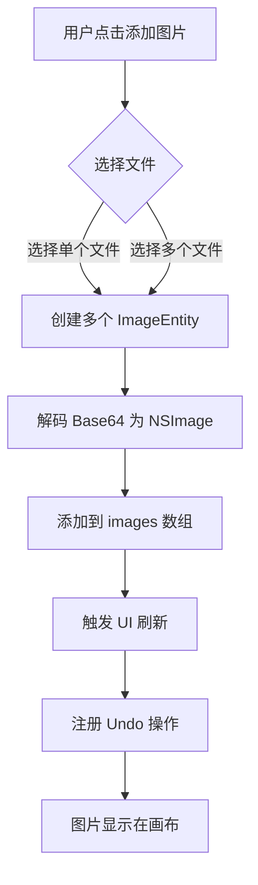

### 13.2 撤销/重做流程

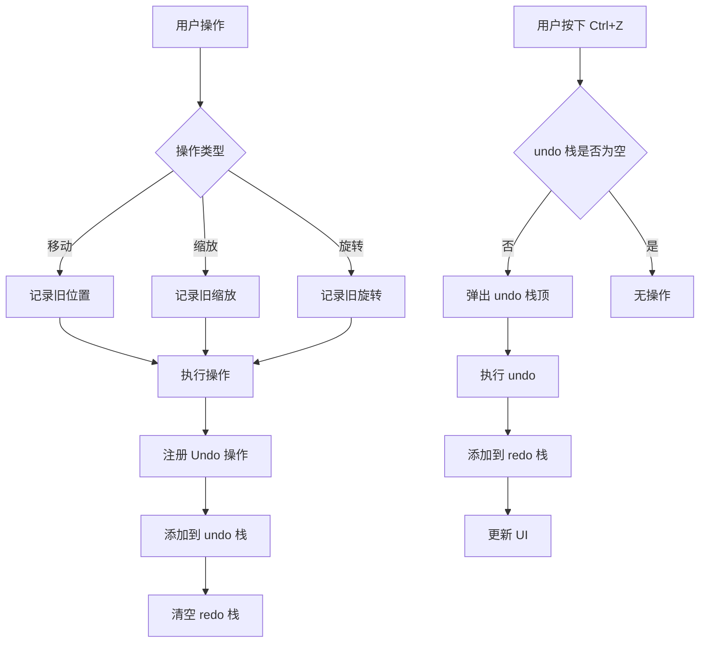

### 13.3 智能整理流程

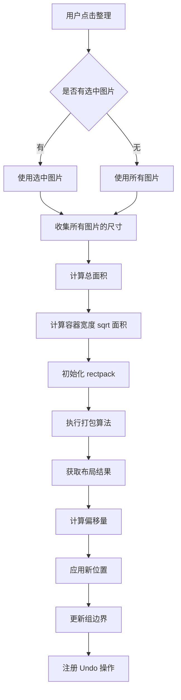

### 13.4 保存/加载流程

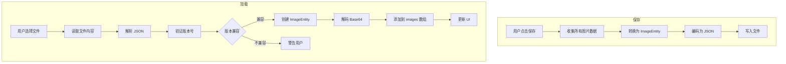

### 13.5 NPU 背景移除流程

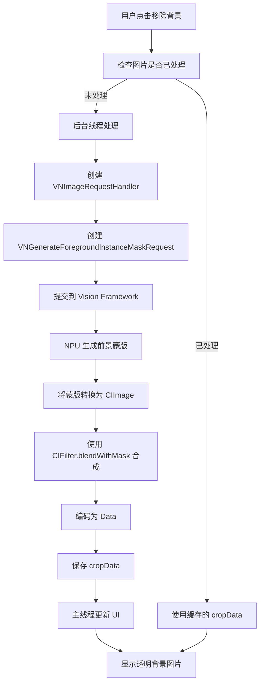

---

## 14. 性能优化深度指南

### 14.1 Windows 性能优化

#### OpenGL 渲染优化

1. **使用 QOpenGLWidget**
   - Qt 自动使用 GPU 加速渲染
   - 大图片无需手动降采样
   - 视口裁剪自动处理

2. **渲染提示设置**
   ```python
   self.setRenderHint(QPainter.Antialiasing)           # 抗锯齿
   self.setRenderHint(QPainter.SmoothPixmapTransform)  # 平滑变换
   ```

3. **活动区域渲染**
   - 仅渲染视口可见范围内的内容
   - 超出视口的内容不触发绘制
   - 使用 `QPainter.setClipRect()` 裁剪

4. **脏矩形优化**
   - Qt 自动追踪需要重绘的区域
   - 只重绘变化的区域
   - 使用 `update(rect)` 而非 `repaint()`

#### 内存优化

1. **撤销栈限制**
   ```python
   undo_manager = UndoManager(max_history=100)
   ```

2. **懒加载图片**
   - 图片数据仅在添加到场景时加载
   - 使用 `QPixmap` 而非 `QImage` (GPU 内存)

3. **释放未使用资源**
   ```python
   # 移除项目时手动清理
   item.setPixmap(QPixmap())  # 释放位图内存
   ```

#### 矩形打包优化

1. **容器宽度计算**
   ```python
   approx_side = int(math.ceil(math.sqrt(total_area)))
   bin_width = max(approx_side, max(w for w, h, it, r in rects))
   ```
   - 基于总面积的平方根计算
   - 确保所有矩形都能放入

2. **并行处理**（未来可优化）
   - 将大任务分解为多个子任务
   - 使用多线程处理不同分组

### 14.2 macOS 性能优化

#### Metal 渲染优化

1. **自动优化**
   - SwiftUI 自动使用 Metal 渲染
   - 视口裁剪自动处理
   - 离屏渲染自动优化

2. **LOD (Level of Detail)**
   ```swift
   let lod = 1.0 / totalScale
   font = font.withSize(baseSize / lod)
   ```
   - 根据缩放级别调整细节
   - 缩小时降低精度

3. **预解码**
   ```swift
   if let nsImage = NSImage(data: imageData) {
       // 预解码为位图
       let rep = NSBitmapImageRep(data: nsImage.tiffRepresentation)
   }
   ```

#### NPU 优化

1. **Vision Framework 缓存**
   ```swift
   if entity.cropData != nil {
       // 使用缓存结果
       return
   }
   ```

2. **后台线程处理**
   ```swift
   Task.detached {
       // NPU 处理
       await MainActor.run {
           // 更新 UI
       }
   }
   ```

3. **批量处理**（未来可优化）
   - 使用 `VNRecognizeAnimalsRequest` 的多个请求
   - 一次处理多张图片

#### 内存管理

1. **ARC 自动管理**
   - Swift 自动引用计数
   - 无需手动释放内存

2. **compactMemory()**
   ```swift
   func compactMemory() {
       images.removeAll { image in
           // 清理不可见图片
           !isVisible(image)
       }
   }
   ```

### 14.3 通用优化建议

1. **图片格式选择**
   - PNG: 适合有透明背景的图片
   - JPEG: 适合照片类图片
   - WebP: 高压缩比，现代格式

2. **Base64 编码优化**
   - 使用 `base64.b64encode(data)` 编码
   - 考虑使用 zlib 压缩进一步减小体积

3. **批量操作**
   - 批量添加图片时合并 Undo 操作
   - 避免每次操作都触发 UI 刷新

4. **延迟加载**
   - 大文件分块加载
   - 使用进度条反馈

---

## 15. 开发调试指南

### 15.1 Windows 调试

#### 日志输出

```python
import logging

logging.basicConfig(level=logging.DEBUG)
logger = logging.getLogger(__name__)

logger.debug("调试信息")
logger.info("普通信息")
logger.warning("警告信息")
logger.error("错误信息")
```

#### 调试撤销/重做

```python
# 打印当前撤销栈状态
print(f"Undo stack size: {len(undo_manager._undo_stack)}")
print(f"Undo description: {undo_manager.undo_description()}")

# 打印所有命令
for i, cmd in enumerate(undo_manager._undo_stack):
    print(f"[{i}] {cmd.description()}")
```

#### 调试场景状态

```python
# 打印场景中的所有项目
items = scene.items()
print(f"Total items: {len(items)}")

ref_items = [i for i in items if isinstance(i, RefItem)]
print(f"RefItems: {len(ref_items)}")

group_items = [i for i in items if isinstance(i, GroupItem)]
print(f"GroupItems: {len(group_items)}")
```

#### 调试几何计算

```python
# 打印项目边界矩形
item = selected_item
rect = item.sceneBoundingRect()  # 左上角

# 打印变换矩阵
transform = item.transform()
print(f"Transform: {transform}")
```

### 15.2 macOS 调试

#### Xcode 断点

1. 在代码行号处点击设置断点
2. 使用 `lldb` 命令检查变量：
   ```
   po images  # 打印 images 数组
   po selectedImageIDs  # 打印选中的ID
   ```

#### print 调试

```swift
print("Debug info: \(images.count) images")
print("Selected: \(selectedImageIDs)")

// 使用 debugDescription
print(images.map { "\($0.id): (\($0.x), \($0.y))" })
```

#### 检测状态变化

```swift
@Observable
class AppState {
    @ObservationIgnored
    var changeCount = 0
    
    private func markChanged() {
        changeCount += 1
        print("State changed: \(changeCount)")
    }
}
```

#### NPU 调试

```swift
// 检查 Vision Framework 可用性
if #available(macOS 12.0, *) {
    print("Vision Framework is available")
}

// 打印请求进度
request.progress.addObserver(\.fractionCompleted) { progress, _ in
    print("Progress: \(progress.fractionCompleted)")
}
```

### 15.3 常见问题排查

#### 问题：图片加载失败

**Windows**:
```python
try:
    pixmap = QPixmap(image_path)
    if pixmap.isNull():
        raise Exception("Failed to load image")
except Exception as e:
    logger.error(f"Error loading image: {e}")
```

**macOS**:
```swift
guard let nsImage = NSImage(contentsOf: url) else {
    print("Failed to load image from \(url)")
    return
}
```

#### 问题：撤销后状态不一致

**排查步骤**:
1. 检查 Command 类的 `undo()` 和 `redo()` 方法是否对称
2. 确保保存的状态完整（位置、缩放、旋转等）
3. 检查是否正确处理了已删除的项目

#### 问题：性能下降

**排查步骤**:
1. 检查撤销栈大小是否过大
2. 使用性能分析工具（Windows: PyInstaller profiler, macOS: Instruments）
3. 检查是否有过多的重绘操作

#### 问题：组边界不正确

**排查步骤**:
1. 检查 `update_bounds()` 方法是否被正确调用
2. 确认成员的 `group_id` 是否正确设置
3. 检查边界计算是否考虑了所有成员

---


## 17. 贡献指南

### 17.1 代码风格

**Windows (Python)**:
- 遵循 PEP 8 规范
- 使用 4 空格缩进
- 最大行长度 120 字符
- 使用类型注解

**macOS (Swift)**:
- 遵循 Swift API 设计指南
- 使用 4 空格缩进
- 使用 `let` 而非 `var`（除非需要修改）
- 优先使用 SwiftUI 原生组件


## 20. 深度技术细节

### 20.1 Qt 图形视图框架内部机制

#### QGraphicsScene 与 QGraphicsView 的协作

**场景坐标系 vs 视图坐标系**:

```
场景坐标系 (Scene Coordinates)
┌─────────────────────────────────┐
│  (0,0)                          │
│  ┌─────────────┐                │
│  │   Item 1    │                │
│  │  (100,100)  │                │
│  └─────────────┘                │
│                                 │
│         ┌─────────────┐         │
│         │   Item 2    │         │
│         │  (300,200)  │         │
│         └─────────────┘         │
└─────────────────────────────────┘

视图坐标系 (View Coordinates)
通过 mapFromScene/mapToScene 转换
```

**渲染管线**:

```
用户操作 → QGraphicsView 捕获事件
         ↓
    坐标转换 (mapFromScene)
         ↓
    QGraphicsScene 管理场景
         ↓
    QGraphicsItem 处理逻辑
         ↓
    QPaintEvent 触发绘制
         ↓
    QOpenGLWidget GPU 渲染
         ↓
    显示到屏幕
```

**视口裁剪优化**:

Qt 自动实现视口裁剪，只绘制可见区域：

```python
# Qt 内部实现（伪代码）
def paintEvent(event):
    visible_rect = mapToScene(event.rect())
    visible_items = scene.items(visible_rect)
    for item in visible_items:
        item.paint(painter)
```

**脏矩形优化**:

Qt 使用脏矩形机制，只重绘变化的部分：

```python
# 手动触发重绘时指定区域
item.update(rect)  # 只重绘 rect 区域
scene.update(rect)  # 只重绘场景中的 rect 区域
```

#### QGraphicsItem 的 ItemChange 机制

```python
def itemChange(self, change, value):
    """Qt 自动调用的变更回调"""
    if change == QGraphicsItem.ItemPositionChange:
        # 位置即将改变
        old_pos = self.pos()
        # 可以在这里限制移动范围
        # value = [min_x, min_y]  # 限制最小位置
    
    elif change == QGraphicsItem.ItemPositionHasChanged:
        # 位置已经改变
        new_pos = self.pos()
        # 更新组边界
        if self.group_id:
            self.update_group_bounds()
    
    elif change == QGraphicsItem.ItemSelectedChange:
        # 选中状态即将改变
        if value:  # 选中
            pass
        else:  # 取消选中
            pass
    
    return super().itemChange(change, value)
```

**可用的 ItemChange 类型**:

| 类型 | 说明 | 用途 |
|------|------|------|
| `ItemPositionChange` | 位置改变前 | 限制移动范围 |
| `ItemPositionHasChanged` | 位置改变后 | 更新组边界 |
| `ItemScaleChange` | 缩放改变前 | 限制缩放范围 |
| `ItemScaleHasChanged` | 缩放改变后 | 更新 UI |
| `ItemSelectedChange` | 选中改变前 | 阻止选中 |
| `ItemSelectedHasChanged` | 选中改变后 | 更新菜单状态 |
| `ItemZValueChange` | 图层改变前 | 限制图层范围 |
| `ItemZValueHasChanged` | 图层改变后 | 更新图层面板 |

### 20.2 SwiftUI 状态管理深入

#### @Observable vs @StateObject

**@Observable (Swift 5.9+)**:

```swift
// 推荐的新方式
@Observable class AppState {
    var images: [ImageEntity] = []
    var canvasOffset: CGSize = .zero
}

// 使用时不需要包装器
let appState = AppState()
// 直接访问，自动触发 UI 更新
appState.images.append(newImage)
```

**@StateObject (旧方式)**:

```swift
class AppState: ObservableObject {
    @Published var images: [ImageEntity] = []
    @Published var canvasOffset: CGSize = .zero
}

// 需要包装器
@StateObject var appState = AppState()
// 访问时不自动触发
appState.images.append(newImage)
```

**对比**:

| 特性 | @Observable | @StateObject |
|------|-------------|--------------|
| 性能 | 更快（无 KVO 开销） | 较慢（KVO 机制） |
| 代码量 | 少（无需包装器） | 多（@Published） |
| 兼容性 | Swift 5.9+ | Swift 5.1+ |
| 调试 | 容易 | 困难 |

#### SelectionManager 的设计

```swift
@Observable
class SelectionManager {
    private(set) var selectedIDs: Set<String> = []
    
    func toggleSelection(_ id: String) {
        if selectedIDs.contains(id) {
            selectedIDs.remove(id)
        } else {
            selectedIDs.insert(id)
        }
        // @Observable 自动触发 UI 更新
    }
    
    func selectAll(_ ids: [String]) {
        selectedIDs = Set(ids)
    }
    
    func deselectAll() {
        selectedIDs.removeAll()
    }
    
    var hasSelection: Bool {
        !selectedIDs.isEmpty
    }
    
    var count: Int {
        selectedIDs.count
    }
}
```

**设计要点**:
- 使用 `Set` 确唯一性和 O(1) 查找
- 使用 `private(set)` 防止外部直接修改
- 提供便捷的计算属性

### 20.3 事件处理深度解析

#### macOS WindowAccessor 原理

```swift
struct WindowAccessor: NSViewRepresentable {
    @Binding var window: NSWindow?
    
    func makeNSView(context: Context) -> NSView {
        let view = NSView()
        // 等待视图添加到窗口后获取窗口引用
        DispatchQueue.main.async {
            self.window = view.window
        }
        return view
    }
    
    func updateNSView(_ nsView: NSView, context: Context) {}
}
```

**工作原理**:
1. 创建一个透明的 `NSView`
2. 当 SwiftUI 将其添加到视图层级时，`view.window` 会自动指向父窗口
3. 在主线程异步获取窗口引用（确保窗口已初始化）
4. 通过 `@Binding` 传递给父视图

**全局事件监听**:

```swift
// 在窗口级别拦截所有鼠标事件
NSEvent.addLocalMonitorForEvents(matching: [.scrollWheel, .otherMouseDown]) { event in
    // 处理事件
    if event.modifierFlags.contains(.control) {
        // Ctrl+滚轮 = 缩放
        handleZoom(event)
        return nil  // 拦截事件，阻止默认行为
    }
    return event  // 不拦截，继续传递
}
```

**事件优先级**:

```
1. NSViewRepresentable (WindowAccessor)
   ↓ (如果未拦截)
2. SwiftUI Gesture
   ↓ (如果未拦截)
3. 默认行为
```

#### Windows 事件传递

```python
# Qt 事件传递顺序
def event(self, event):
    # 1. 事件过滤器
    if self.eventFilter(event):
        return True  # 拦截
    
    # 2. 特定事件处理
    if event.type() == QEvent.KeyPress:
        if self.keyPressEvent(event):
            return True
    
    # 3. 默认处理
    return super().event(event)

def mousePressEvent(self, event):
    # 检查是否点击在特定位置
    if event.button() == Qt.MiddleButton:
        self.start_panning(event.pos())
    elif event.button() == Qt.LeftButton:
        self.handle_selection(event.pos())
```

### 20.4 内存管理策略

#### Windows 版本 (Python)

**自动内存管理**:

```python
# 引用计数自动管理
def add_image(self, image_path):
    pixmap = QPixmap(image_path)  # 引用计数 +1
    item = RefItem(pixmap)        # item 引用 pixmap
    self.scene.addItem(item)      # scene 引用 item
    # 方法结束时，pixmap 的引用计数 = 2
    # item 的引用计数 = 1
    # 当 item 从 scene 移除时，引用计数归零，自动释放

def delete_item(self, item):
    self.scene.removeItem(item)   # scene 释放 item
    # item 引用计数归零
    # pixmap 引用计数归零
    # 自动调用 __del__ 清理资源
```

**显式清理**:

```python
def clear_board(self):
    # 方式1: 逐个删除
    for item in self.scene.items():
        self.scene.removeItem(item)
    
    # 方式2: 批量删除（更快）
    self.scene.clear()
    
    # 方式3: 显式调用 GC（如果需要）
    import gc
    gc.collect()  # 强制垃圾回收
```

#### macOS 版本 (Swift)

**ARC 自动引用计数**:

```swift
class AppState {
    var images: [ImageEntity] = []  // 强引用
    
    func addImage(_ image: ImageEntity) {
        images.append(image)  // 强引用计数 +1
    }
    
    func removeImage(_ id: String) {
        if let index = images.firstIndex(where: { $0.id == id }) {
            images.remove(at: index)  // 强引用计数 -1，归零时释放
        }
    }
    
    // 内存压缩
    func compactMemory() {
        images.removeAll { image in
            // 移除不需要的图片
            return !image.isVisible
        }
    }
}
```

**循环引用预防**:

```swift
// 错误示例：循环引用
class Parent {
    var child: Child?
    deinit { print("Parent deinit") }
}

class Child {
    var parent: Parent?  // 强引用
    deinit { print("Child deinit") }
}

// Parent -> Child -> Parent 循环引用
let parent = Parent()
parent.child = Child()
parent.child?.parent = parent
// 内存泄漏！

// 正确示例：使用 weak
class Child {
    weak var parent: Parent?  // 弱引用
    deinit { print("Child deinit") }
}

// parent 释放时，child 的 parent 自动设为 nil
```

**NSImage 缓存策略**:

```swift
class ImageCache {
    private var cache = NSCache<NSString, NSImage>()
    
    func get(for key: String) -> NSImage? {
        return cache.object(forKey: key as NSString)
    }
    
    func set(_ image: NSImage, for key: String) {
        cache.setObject(image, forKey: key as NSString)
    }
    
    func clear() {
        cache.removeAllObjects()
    }
}
```

### 20.5 性能分析工具

#### Windows 版本

**使用 cProfile 分析性能**:

```python
import cProfile
import pstats

def main():
    profiler = cProfile.Profile()
    profiler.enable()
    
    # 运行应用
    app = QApplication(sys.argv)
    window = MainWindow()
    window.show()
    app.exec()
    
    profiler.disable()
    
    # 保存分析结果
    profiler.dump_stats('profile.prof')
    
    # 打印统计信息
    stats = pstats.Stats('profile.prof')
    stats.sort_stats('cumulative')
    stats.print_stats(20)  # 打印前20个最耗时的函数
```

**使用 memory_profiler 分析内存**:

```bash
# 安装
pip install memory_profiler

# 运行
python -m memory_profiler App.py
```

**Qt 内置性能监控**:

```python
# 启用 OpenGL 调试输出
QLoggingCategory.setFilterRules("qt.qpa.gl=true")

# 监控渲染性能
QSurfaceFormat format = QSurfaceFormat()
format.setOption(QSurfaceFormat.DebugContext)
QSurfaceFormat.setDefaultFormat(format)
```

#### macOS 版本

**使用 Instruments**:

```bash
# 启动 Instruments
open -a Instruments

# 选择 Time Profiler 分析 CPU
# 选择 Allocations 分析内存
# 选择 Core Animation 分析渲染性能
```

**使用 Xcode 性能分析**:

1. 在 Xcode 中运行应用
2. 点击 Debug Navigator (⌘7)
3. 选择 Performance Monitor 查看实时数据
4. 点击 "Profile in Instruments" 进行深度分析

**Swift 内存泄漏检测**:

```swift
// 使用 Xcode Leaks Instrument
// 或手动检查
class MyClass {
    deinit {
        print("MyClass deinit")  // 如果没有输出，说明有内存泄漏
    }
}

// 使用 weak 检查
weak var weakRef = myObject
if weakRef == nil {
    print("对象已释放")
}
```

---

## 21. 故障排除指南

### 21.1 常见错误诊断

#### Windows 版本

**错误: `ImportError: No module named 'PySide6'`**

```bash
# 解决方案
pip install PySide6

# 如果版本冲突
pip uninstall PySide6
pip install PySide6==6.5.0
```

**错误: `OpenGL error: 1286`**

```
原因: OpenGL 版本不兼容或显卡驱动问题

解决方案:
1. 更新显卡驱动
2. 降低 OpenGL 版本要求
3. 使用软件渲染（性能较低）
```

**错误: 大图加载崩溃**

```python
# 添加内存检查
import psutil

def check_memory():
    mem = psutil.virtual_memory()
    if mem.percent > 80:
        QMessageBox.warning("内存不足，请清理后重试")
        return False
    return True
```

#### macOS 版本

**错误: `Cannot find 'VNGenerateForegroundInstanceMaskRequest'`**

```
原因: macOS 版本低于 12

解决方案:
1. 升级到 macOS 12+
2. 或禁用背景移除功能
```

**错误: `NSWindow is nil`**

```swift
// 确保 WindowAccessor 在视图层级中
WindowAccessor { window in
    // 等待窗口初始化
    if let window = window {
        setupEventMonitor(for: window)
    }
}
```

**错误: SwiftUI 性能卡顿**

```swift
// 优化方案
struct ContentView: View {
    // 使用 @State 而非 @StateObject（对于简单值）
    @State var isDragging = false
    
    // 使用 @StateObject（对于复杂对象）
    @StateObject var appState = AppState()
    
    // 使用 @Published 精细化控制
    @Observable class AppState {
        // 不要让所有属性都触发更新
        var _internalValue: Int = 0
        var publicValue: Int {
            get { _internalValue }
            set { 
                if newValue != _internalValue {
                    _internalValue = newValue
                    // 只在值改变时触发更新
                }
            }
        }
    }
}
```

### 21.2 调试技巧

#### Windows 版本

**启用 Qt 调试输出**:

```python
import sys
from PySide6.QtCore import qInstallMessageHandler

def message_handler(mode, context, message):
    # 自定义日志输出
    print(f"[{context.file}:{context.line}] {message}")

qInstallMessageHandler(message_handler)
```

**使用 Python 断点**:

```python
import pdb

def my_function():
    x = 1
    pdb.set_trace()  # 断点
    y = 2
    return x + y
```

**日志记录**:

```python
import logging

logging.basicConfig(
    level=logging.DEBUG,
    format='%(asctime)s - %(name)s - %(levelname)s - %(message)s',
    filename='app.log'
)

logger = logging.getLogger(__name__)
logger.debug("Debug message")
logger.info("Info message")
logger.error("Error message")
```

#### macOS 版本

**使用 print 调试**:

```swift
func myFunction() {
    print("Debug: function called")
    let value = calculateSomething()
    print("Debug: value = \(value)")
}
```

**使用断言**:

```swift
func divide(_ a: Int, by b: Int) -> Double {
    assert(b != 0, "Division by zero")
    return Double(a) / Double(b)
}
```

**使用 os_log**:

```swift
import os.log

let logger = OSLog(subsystem: "com.yourapp.HajimiRef", category: "Canvas")

func logSomething() {
    os_log("Canvas initialized", log: logger, type: .info)
    os_log("Error occurred: %@", log: logger, type: .error, "detailed error")
}
```

---

## 22. 扩展开发指南

### 22.1 添加新的图片格式支持

#### Windows 版本

```python
from PIL import Image

class WebPHandler:
    @staticmethod
    def can_load(file_path):
        return file_path.lower().endswith('.webp')
    
    @staticmethod
    def load(file_path):
        image = Image.open(file_path)
        return image.tobytes()
    
    @staticmethod
    def save(pixmap, file_path):
        # 使用 PIL 保存 WebP
        pass

# 在 MainViewModel 中注册
handlers = [WebPHandler(), AVIFHandler()]
```

#### macOS 版本

```swift
extension NSImage {
    convenience init?(webpData: Data) {
        guard let source = CGImageSourceCreateWithData(webpData as CFData, nil),
              let cgImage = CGImageSourceCreateImageAtIndex(source, 0, nil) else {
            return nil
        }
        self.init(cgImage: cgImage, size: .zero)
    }
}
```

### 22.2 添加 AI 功能

#### 集成 OpenCV (Windows)

```python
import cv2
import numpy as np

def detect_edges(image):
    # 转换为 OpenCV 格式
    img_array = np.array(image)
    gray = cv2.cvtColor(img_array, cv2.COLOR_RGB2GRAY)
    edges = cv2.Canny(gray, 100, 200)
    return edges

def apply_blur(image, amount=5):
    img_array = np.array(image)
    blurred = cv2.GaussianBlur(img_array, (amount, amount), 0)
    return blurred
```

#### 使用 CoreML (macOS)

```swift
import CoreML
import Vision

// 加载自定义 ML 模型
let model = try! YourModel(configuration: MLModelConfiguration())

// 创建 Vision 请求
let request = VNCoreMLRequest(model: try! VNCoreMLModel(for: model.model)) { request, error in
    guard let results = request.results as? [VNClassificationObservation],
          let topResult = results.first else {
        return
    }
    print("Result: \(topResult.identifier)")
}

// 处理图片
let handler = VNImageRequestHandler(cgImage: cgImage)
try? handler.perform([request])
```

### 22.3 添加导出功能

#### 导出为 PDF (Windows)

```python
from PySide6.QtGui import QPainter, QPdfWriter

def export_to_pdf(items, file_path):
    writer = QPdfWriter(file_path)
    painter = QPainter(writer)
    
    # 计算总边界
    rect = QRectF()
    for item in items:
        rect = rect.united(item.sceneBoundingRect())
    
    # 绘制
    for item in items:
        painter.save()
        painter.translate(item.sceneBoundingRect().topLeft())
        item.paint(painter, QStyleOptionGraphicsItem(), None)
        painter.restore()
    
    painter.end()
```
